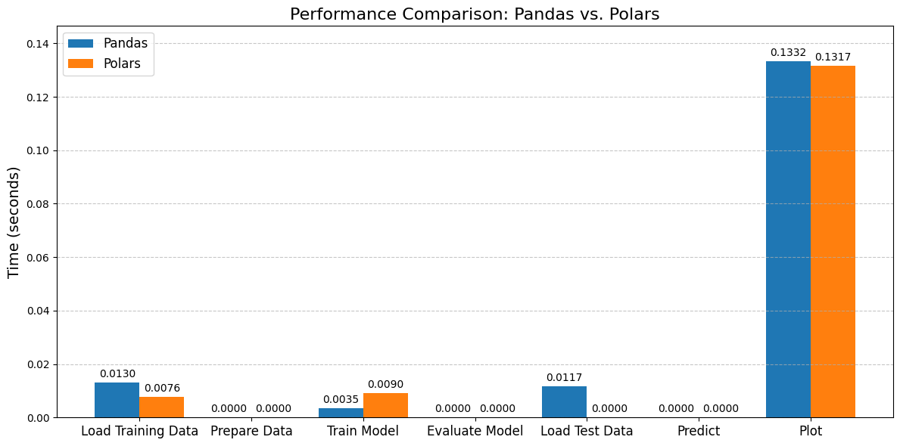

# Linear Regression: Polars vs. Pandas

This repository showcases a benchmark comparison between Polars and Pandas for data loading, model training, evaluation, and plotting tasks in a house price prediction model. The aim is to highlight the performance differences between Polars and Pandas in various metrics.

## Linear Regression Model

In this project, I implemented a Linear Regression model to predict house prices based on various features. The model was trained using historical data, and evaluated its performance using metrics such as **Mean Squared Error (MSE)**, **Mean Absolute Error (MAE)**, and **R-squared values**. This approach provides a fundamental understanding of how features influence house pricing.

### Key Metrics for Linear Regression:

- **Mean Squared Error (MSE):** 2,810,942,965.22  
- **Mean Absolute Error (MAE):** 36,018.56  
- **R-squared:** 0.63  

These metrics indicate that the linear regression model captures trends in the data reasonably well, providing a decent basis for predicting house prices.


## Differences Between Polars and Pandas

Polars and Pandas are both popular libraries used for data manipulation and analysis in Python, but they have key differences that cater to different use cases. Here’s a comparison highlighting their main differences:

| Feature                     | Pandas                              | Polars                             |
|-----------------------------|-------------------------------------|------------------------------------|
| **Performance**             | Slower for large datasets due to single-threaded execution and memory overhead. | Faster, leveraging multi-threading and optimized execution for large datasets. |
| **Memory Efficiency**       | Higher memory usage due to its DataFrame implementation and data storage. | More memory efficient with Arrow arrays, leading to lower memory overhead. |
| **API**                     | Mature and extensive, widely used in the data science community. | Similar API to Pandas but still evolving; may lack some advanced features. |
| **Lazy Evaluation**         | Does not support lazy evaluation; operations are executed immediately. | Supports lazy evaluation, allowing for query optimization before execution. |
| **DataFrame Operations**    | Comprehensive support for various data manipulation operations. | Similar capabilities, but designed to handle operations on larger datasets efficiently. |
| **Data Types**              | Supports a wide range of data types, including mixed types in columns. | Strongly typed, requiring uniform data types in columns for better performance. |
| **Ecosystem Integration**    | Integrates well with other libraries in the Python ecosystem (e.g., NumPy, Matplotlib). | Also integrates with the Rust ecosystem and Arrow, enhancing interoperability. |
| **Use Cases**               | Best suited for smaller to medium-sized datasets or exploratory data analysis. | Ideal for large-scale data processing tasks, ETL pipelines, and performance-critical applications. |

## Summary
- Pandas is a well-established library with extensive functionality, making it a popular choice for data analysis tasks, especially for smaller datasets. However, it may struggle with performance when handling larger data volumes.

- Polars is a newer alternative that excels in performance and memory efficiency, making it suitable for working with larger datasets and complex data processing tasks. Its use of lazy evaluation and multi-threading provides significant speed advantages.

## Benchmark Results

The following table summarizes the performance of Polars compared to Pandas. The metrics evaluated include loading training data, loading test data, training the model, evaluating the model, predicting prices, and plotting results.

| Metric                | Pandas (seconds) | Polars (seconds) | Difference (Faster/Slower)         |
|-----------------------|------------------|------------------|------------------------------------|
| **Load Training Data** | 0.0130           | 0.0076           | Polars Faster by 41.54%           |
| **Prepare Data**       | 0.0000           | 0.0000           | No Difference                     |
| **Train Model**        | 0.0035           | 0.0090           | Pandas Faster by 61.11%           |
| **Evaluate Model**     | 0.0000           | 0.0000           | No Difference                     |
| **Load Test Data**     | 0.0117           | 0.0000           | Polars Faster                     |
| **Predict**            | 0.0000           | 0.0000           | No Difference                     |
| **Plot Results**       | 0.1332           | 0.1317           | Polars Faster by 1.13%            |

### Highlights:
- **Load Training Data:** Polars showed a significant 41.54% improvement in loading training data compared to Pandas.
- **Training the Model:** Pandas trained the model 61.11% faster than Polars, showing better performance in model training tasks.
- **Plotting Results:** Polars was slightly faster by 1.13% when generating plots, which could be useful for visualization tasks.

## Visual Comparison

Below is a histogram illustrating the performance differences between Pandas and Polars:



## Conclusion

The benchmark results reveal that while both Pandas and Polars have their strengths, Polars outperforms Pandas in specific tasks such as loading data and plotting results. This comparison emphasizes the potential of Polars in performance-critical applications, especially for data manipulation and visualization. On the other hand, Pandas remains faster for model training in this scenario.

The linear regression model presented here demonstrates how both libraries can be applied to real-world data science tasks, such as predicting house prices.

## Usage

To replicate these benchmarks, follow the instructions provided in the codebase. Ensure you have both Polars and Pandas installed in your Python environment.
- The dataset used for training the model can be found [here](https://www.kaggle.com/c/house-prices-advanced-regression-techniques/data).
## Installation

You can install Polars and Pandas using pip:

```bash
pip install pandas polars
```

## Acknowledgments

Thanks to the developers of Polars and Pandas for providing such powerful tools for data manipulation and analysis.
